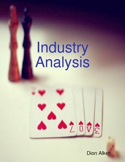
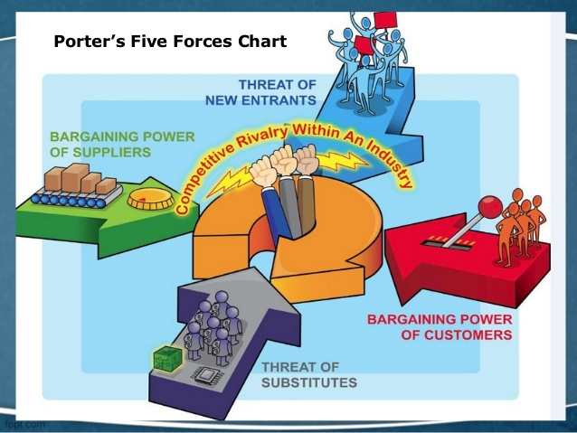
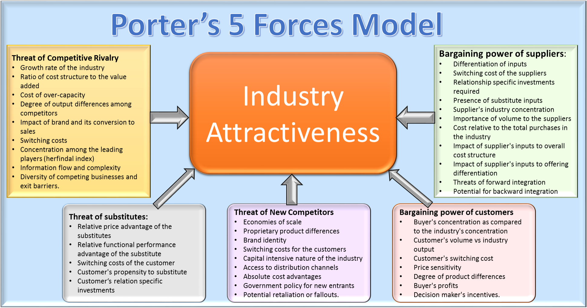

<!-- $theme: gaia -->
<!-- $size: 16:9 -->

# 

Notes of Industry Analysis
===

#### 2016-08
#### Dr. Tianxi Liu 
#### tx@zixuntouzi.com

--- 
<!-- page_number: true -->
## Contents

1.  Introduction
2.  The Five Force Model
3.  Barging Power: Customers and Suppliers
4.  Barriers to Entry
5.  Substition
6.  Rivalry 
7.  The Instry Life Cycle
8.  Strategic Challenges

---
# ==1.== Introduction

#### 1.1 Industry defintion
#### 1.2 Industry Analysis
#### 1.3 Industry Analysis Process

---
## ==1.1== Industry Definition

---
## Defining "Industry"

- Traditional definition
  >  A group of companies or firms competing in a specific geographic region.

:arrow_down: 

- Current definition
  >  ==**A group of suppliers with a similar set of product and process technologies that fill some applied need of a definable group of customers.**==

---
## "Industry": Traditional Review

- An industry is the ==sellers== in the market.
- A market and the requirements of the ==customer== in it characterize the industry.
- Traditonal view of an industry:
  *  ==Where== Is the market being served global, regional, national or local?
  *  ==Who== are the customers, and why do they need the product?
  *  ==What== technologies defined the procucts's function and method of production?

---
## "Industry": A new view

- Focus on customer application.
- What, why and how customers use a product.
- Alternatives could change or replace industry.
- Customer driven strategies.
- Cooperate.

---
## ==1.2== Industry Analysis

---
## Industry analysis is a process for understanding and evaluation the economic forces that determine a company's ==strategy== and ==financial== performance. 

---
## Industry analysis provides a method for analyzing the effects of ==competition== and ==growth== on an industry's structrue and behavior.

---
## Supprots risk and relationship management
- Portfolio Strategy and Planning
  * Business strategy & target market analysis.
  * Identify a target market.
  * Understand the economic forces operation in a target market.
  * Identify the external business risk.
  
- Portfolio Organization and Maintenance
  *  Understand and predict company performance.
  *  Due diligence. 
 
---
## Insights generated from industry analysis

-  How competitive is the industry as a whole?
-  Do new competitors / technologies pose a threat to companies in the industry?
-  Are current growth rates / profits sustainable?
-  Who are the industry's customers?
-  How mature is the industry?
-  Is a company's strategy sensible given known industry conditions?
-  ......

---
## ==1.3== Industry Analysis Process

---
## Collection Industry Information

-  Who would have an intrest in tracking / measuring industry information?
-  Why would they have an intrest in this industry?
-  Google, Baidu, Newspages
-  Company annaul reports
-  Industry outlook reports, investment banks analysis reports.
-  Govenment reports, OECD / WEF reports
-  Industry associations, Information intelligence,
-  Rating agenies...

---
## Competitive Dynamics

- 5 forces, 3 dimention: Structure, behavior, and performance
- ==Structure==: determines the intensity of competition and fundenmental profitability.
- ==Behavior==: the action of buyers and sellers, of a firm toward its customers, and a firm's deceion to enter / leave the industry.
- ==Performance==: profitability and growth.
- Existence / strength of an industry's bargining power.
- Existence / strength of the barriers to entering an industry.
- Risks and opportunities associated with product substitutions. 
- Terms on which companies compete within the industry.

---
## Growth Dynamics

- Growth rates varies.
- Characteristics associated with industry maturity.
- Stategic challenges.
 

==Demand :arrow_right: Growth :arrow_right: Industry Maturity :arrow_right: Strategic Challenges==

---
# ==2.== The Five Force Model

---
## 

---
## Five economic forces

1.	Bargaining power of industry customers.
2.	Bargaining power of suppliers to the industry.
3.	Threat of new competitors entering the industry.
4.	Threat of substitute products from another industry.
5.	Rivalry among existing forms.
6.	\*Government policy.

---
## Using the Five Force Model in Industry Analysis

- Understanding profitablity
-  Power lead to profits
-  Powerless , un profitable industry, example: commercial real estate in the U.S. and Japanin the late 1980s.
-  Powerful, profitable industry, example: ethical pharmaceuticals.
-  Instablity at extrems
-  Guide to relative power
-  Predicting impact of changes

---
## 

---
# ==3.== Barginining Power -  Customers and Suplliers

---
## Price Trend reflect bargining power

- Price rise faster than the cost of input: strong bargining power
- Otherwise, weak bargining power
- Relative price change are the result, not the cause
- Bargining power is determined by:
  * industry structure
  * conditions of supply
  * condtiions of demand
  * a product's value to customers
  * ……

---
## Factors that Determine Bargining Power

- Five Primary Factors :heart: Three Secondary Factors
  * ==Strategic role of product or service==
  * ==Number of suppliers / customers==
  * ==Switching cost==
  * ==Availablty of substitues==
  * ==Supply / demand balance==
  * *Customer profitablity*
  * *Share of total cost*
  * *Threat of vertical integration*
 
---
## Bargining Power Checklist(1/2)

|Seller Power|Factor|Buyer Power|
|:-:|:-:|:-:|
|Critical for cost, quality, or ability to implement strategy|Strategic role of product or service|Unrelated to customer strategy|
|Many customers /few suppliers |Number of Suppliers / Customers|Few Customers / many suppliers|
|High cost of developing, testing, using;or high risk|Swtiching cost|Low cost / low risk|
|Substitutes unavailable or very expensive|Availability of substitutes|Cost-effective substitues widely available|

---
## Bargining Power Checklist(2/2)

|Seller Power|Factor|Buyer Power|
|:-:|:-:|:-:|
|Demand exceeds supply|Supply / demand balance|Supply exceeds demand|
|Low competitive, income rising and secure|Customer profitability|High competitive, income failing or insecure|
|Small share: \<1%|Share of cost|Large share: \>10%|
|Many suppliers are forward integrated;or low barriers to forward integration|Threat of vertical integration|Many customers are backward integrated;or low barriers to backward integration|
 

---
## 3.1 Strategic Role of Product or Service

#### Nedd for Product
- Why a buyer need the product
  * Product's value proposition: net benefits
  * Buyer's strategy: real need

#### Seller bargining power
- Whether the product's benefits are critical to the buyer

---
## 3.2 Number of Suppliers / Customers

- Few suppliers, many buers
  * example: supermarkets in UK 
- Many suppliers, few buyers
  * exmample: unskilled labor
- Single buyer / captive market

---
## 3.3 Switching Cost

- Swtiching cost: developing, testing, or using an alternative product, including change the capital equipment.
- Many studies have found that switching cost can offset price differences of 20% or more.
- *underestimated* by suppliers and *overestimated* by buyers.
- Buyer's risk
- High switching cost or risks give the seller relatively more leverage.
- When switching costs and/or risks are low, the product has become a comondity. Then the primary basis of competition is price.

---
## 3.4 Availability of Substitues

- In most cases, the cost of substituting a differenct product is much higher than the cost of swtiching suppliers of the same product.
- When cost-effective substitues are widely available, it tend to increase buyer power.
- The lack of substitues, or substitues are relatively expensive, tends to strengthen the powe of sellers.

---
## 3.5 Supply / Demand Balance

- Demand > Supply: strengthen seller power, otherwise, strengthen buyer power.
- Applicable situations
  * No monopoly producers / monopsony buyers
  * Capctity must be difficult for seller to manage flexibly.
  * The product must be a commondity or near commondity with very low switching costs.
  * Few substites exists for the product or there are very high direct substitution or switching costs.

---
## 3.6 Customer profitablity

- When customers incomes are rising and secure, customers tend to focus on investment and expansion stategies. Customers are less likely to search fro bargins. Conversely, customers look for ways to economize, and seller lse their power.

---
## 3.7 Share of Total Cost

- Seller's bargining power: \< 1%
- Buyer's  power: \> 10%

---
## 3.8 Threat of Vertical Integration

- Forward integration: buys or invests in a customer industry
- Backword integration: buys or invests in a supplier industry
- The impact is like substituion 

---
## 4 Barriers to Entry

---
## Factors that Determine Barriers to Entry

- Economics of Scale
- Proprietary technologies
- Product differentiation
- Cost disadvantages independent of size
- Goverment policy
- Access to distribution channels
- Risk of retaliztion
- Capital requirements

---
### Barries to Entry Checklist(1/2)

|High|Factor|Low|
|:-:|:-:|:-:|
|High-capacity plant needed for ecomonicperation|Economies of Scale|Production ecomonies unrelated to size|
|Unavailable to entrants|Proprietary technologies|Relevant technologies widely available|
|Products tailored to individual customer needs|Prodcution differentiation|Commondity products|
|Many(e.g. supply arrangements, labor costs, experience curves)|Cost disadvantages independent of size|Few|

---
### Barries to Entry Checklist(2/2)

|High|Factor|Low|
|:-:|:-:|:-:|
|Closely controlled|Access to distribution channels|Open and competitive|
|Constrained by policy or regulation|Government policy|Liberal trade and ecominic policies|
|Market share leader attck new entrants; intense internal rivalry|Risk of retailation|Market share widely distributed or weak internal rivalry|
|Very large (e.g. over $1 billion) or high relative to  total dusntry profits|Capital requriements|Small (under $1 million)|

---
## 4.1 Economics of scale

- The per unit cost decrease dramatically as the company's size increase.
- Example: semiconductor, primary steel production, electricity generation.
- Non production functions: marketing, sales, distribution. Example: Wal-Mart, advertising on TV.
- Economics of scale -> High barriers to entry!

--- 
## 4.2 Proprietary Technologies

- Exclusive skills, knowledge, technology
- Know What, Know How
- The barriers to entry increase with the number and complexity of technologies and skills the comany must acquire and master in order to become a competitor.

---
## 4.3 Production Differentation

- Industry with commodity products and low swtiching costs are the most open to new entries.
- Example: fruits, grains, comsumer products.

---
## Costdisadvantages Independent of Size

- Productivity, location, experience, wage rates
- For example: fast foods need real estate.

---
## 4.5 Government Policy (1/2)

- Restic competition: protect the market for demestic producers or minimizing competition as part of goverment employment policy
- Examples: telecomunications, broadcasting, newspapers, defence, financial services, airlines, energy, and natural resources such as timber, mining, or fishing.
- Encouraging competition: Encorage to enter new markts.
- Examples: Deregulating industries and enforcing anti-trust statues.

### Government Policy： Indirect techniques

---
### 4.5 Government Policy (2/2) ： Direct techniques

  * Sponsorship of state-owned monopoly
  * Establishment of unsual product or satety standards that must be met by new entrats to a market
  * Licencing requirements that are difficult to satisfy and/or licences that are awarded infrequetly
  * Requirements licences before that can do business.
  * Polices that requrie official government approval prior to enteringa sensitive industry
  * Foreign entrants securead domestric partner or part-owner
  * Polices to transfer or relingquish Propritary technolgies to compel.

---
## 4.6 Access to Distribution Channels

- Direct investment, throgh close allicances based on a long history of joint promotion and services.
- In economies with stable distribution channels, obtaining distribution can be the most significant of all barriers to entry.
- New distribution, barriers to entry may collpase.

---
## 4.7 Risk of Relaliation

- High in competitive industries, when：
  * Market share leaders have a favorable position to defend and resources to mount an attack
  * Economics of scale diccate strategies to preserve / gain market share.
- Price reduction, new product introduction, aggresive promotion, distributuion alliances.

---
## 4.8 Capital Requirements

- High barries when absolute cost of entering a market is high, for example: $1 biliion.
- Otherwise, low arries.

---
## 5. Substitution

#### Use of a product from another industry to satisfy needs.

---
## Risks / Benefits of Substitution

- Opportunity: Primary process to create a new industry. 
- Risk: same customer needs, better price performance ratio.
- Complex analysis: in-depth technical and market understanding.
- The economics of investment in innovation, relative rates of technological progress, long-term cost stuctures.

---
## Substitution Analysis Checklist(1/2)

|Strong Threat|Factor|Weak Threat|
|:-:|:-:|:-:|
|One or more known substitues can fulfill customer's strategic needs|Substituion available|No known substitue meet customer's requirements|
|Active and exprensive search for substitues(customer cost pressure or dedesire for new benefits|Demand for substitution|No cost pressure on customers and no significant investment in related technology|
|outperfoms|current performance|not outperforms|

---
## Substitution Analysis Checklist(1/2)

|Strong Threat|Factor|Weak Threat|
|:-:|:-:|:-:|
|improving|performance trends|declining|
|favor|performance limit|not favor|
|less|current price|more|
|relative less|price trend|relative more|
|favor|price limit|not favor|

---
## 5.1 Availabity of Substitution

- If one or more known products exits can fulfil the same strategic needs as the industry's product.
- If no, then the current risk from substitution is low.

---
## 5.2 Demand for Substitution

- Customer applications undelie demand
- Is there evidence that they are unhappy with current prices?
- Product complements
- Ongoing risk

---
## 5.3 Relative Rates of Technological Progress

- Current performance of the substitute
  * Does the substitute or potential substitutes outperform the industry product on some dimensions?
- Substitue Performance Trends
  * If the substitue's performance improving faster than the industry's product?
- Limits to Change in Substitue Performance
  * The potential for improvements in the substitues's fundamental technologies.

---
## 5.4 Cost Structure

- Current Price of Substitutes
  * Whether the substitute is less expensive
  * Whether is the switching cost is low
- Trend in Substitute Price
  *  Is the substitute becoming less expensive over time?
  *  Is affected by comodity price volatility? Bebefit from scale economics? Are the price changes a response to shifts in demand, or are they purely tactical?
- Limits to Change in Substitute Price
  
---
# 6. Rivalry

---
#### Rivalry Checklist(1/2)

|Strong Rivalry|Factor|Weak Rivalry|
|:-:|:-:|:-:|
|Many competitors without a dominant market share leader|Industry concentration|Market share is highly concertrated among 3 or 4 competitors|
|Undifferentiated commondities|Product differenctiation|Unique offerings by each competitor|
|Asset intensive, with high fixed costs and low variable costs|Required fixed cost and investment|Low asset intensity and fixed costs|
|Minimum  |Ratio of scale investment to market size|Capacity can be closely matched to changes in demand|

---
#### Rivalry Checklist(2/2)

|Strong Rivalry|Factor|Weak Rivalry|
|:-:|:-:|:-:|
|Liberal international trade and active anti-trust enforcement|Government Policy|Trade barriers and weak anti-trust enforcement|
|Dedicated assets, process, and technologies; many legal, regulatory, labor, and other liabilities |Industry exit barriers|Few|
|Opportunites to create dominant positions in high growth or high profit industries|Strategic stakes|Slow demand and growth|
|Different|Diversity of firms|Similar|

---
## 6.1 Industry Concertration

- Inverse relationship
- higly concentrated market: CR4 or CR3 > 75%，80%）
- “Signaling"

---
## 6.2 Production differentiation

- Similary increase rivalry

---
## Required Fixed Cost and Investment

- Operating Leverage
- Paper marking, oil refining, alumnum smelting, textiles and bulk chemicals.
- Software developers, discount retailers, telecommunications carriers, airlines
- Price cutting.

---
## Ratio of Scale Investment to Market Size

- Ecominics of scale may increase rivalry
- >3-4%

---
## Government Policy

- Anti-trust or deregulation

---
## Industry Exit Barriers

- Dedicated assets, technologies and processes
- Cost of an environment cleanup or laying off workers
- Exit barriers increase rivalry

---
## Strategic Stakes

- Market leadership: winner-take-all
- e.g. Mircosoft and OS
- High stakes increase rivalry
- High technology products, oil, gas, spectrum.

---
## Diversity of Firms

- Similarity decrease rivalry

#### Rivalry and Other Structural Forces
- Strong rivalries tend to exit when other structural forces weaken an industry. 
- When demand falls below supply, increase rivalry
- When switching cost is low, rivalry high.
- ......

---
## 7. The Industry Life Cycle

---
## Product life cycle

- New product has predictable life
- New = Substitute
- Standard pattern: 
  * Introduction :arrow_right: Roll out :arrow_right: Market penetration :arrow_right: Market staturation :arrow_right: Obscolescence and replacement.
- variations to pattern

---
## Industry Cycle

- Emerging :arrow_right: Growth :arrow_right: Mature :arrow_right: Aging
- Growth rate and knowledge about potential demand
- Number of competitors, products, and product lines
- Stability of purchasing patterns
- Technologies investment strategies
- Barriers to entering the industry

---
## Emerging Industries

- Growth / demand. increasing, but no industry-wide measurement of demand, and no common standard for quantifying industry growth rate.
- Competition / makret share. Hard to assess sales potential. Few competitors, but increase. 
- Purchasing / product lines. Narrow, tailored.
- Barriers / technology. Low, if the cost os acquiring key technologies and knowledge is also low.
- Examle: digital cash, electronic commerce.

---
## Growth Industries

- Growth / demand. Grows more rapidly than GDP, often 20%+ for everyone. Demand exceeds current supply, but its potential limits are unknown.
- Purchasing / product lines. Repeat purchases, price sensitivity. Product brand strategies become important. Product lines increase.
- Competition / market share. The number of competitors is unstable. The ranking may change.
- Barriers / technology. Barriers to entry grow. Basic processes and technologies are increasingly standardeized. Technology investments are directed at new products and  enhancement.
- Example: Health Information System.

---
## Mature Industries

- Growth / Demand.  Grow rates are similar to the overall GDP. The limits of demand are well known, and market approach sataration.
- Competition / market share. Stable and delcines slowly. Market share ranking are highly stable, and competition is a race to find defensible nicles.
- Purchasing / product lines. Purchasing patterns are welle established for well-known suppliers. Product lines shows little net change.
- Barriers / technology. Technology investments aim for process refinement and efficiency. 
- Example: Automobiles in G-7.

---
## Aging Industries

- Growth / demand. Negative or significantly slower than GDP. Supply exceeds long-term demand.
- Competition / makret share / barriers. The number of competitors falls. Industry becomes regionalized. More concentraed. 
- Product lines / technlogy. Standardized. There is little investment in promotion. New investment is usually aimed at reducing costs.
- Exaple. Computer. 

---
#### Industry Maturity Matrix
|Dimension|Emergency|Growth|Mature|Aging|
|:-:|:-:|:-:|:-:|:-:|
|Growth rate|Accelerating|20%+|Close to GDP|\<GDP|

